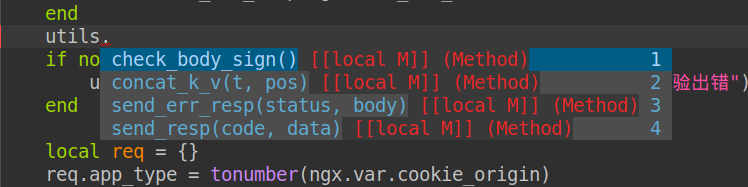

# Emmy Lua Language Server

CI status  | Download
---------- | ----------
[](https://ci.appveyor.com/project/EmmyLua/emmylua-languageserver)|[EmmyLua-LS-all.jar](https://ci.appveyor.com/project/EmmyLua/emmylua-languageserver/build/artifacts)


Emmy lua Language server have lots of features for lua language, including:
* Find usages
* Go to definition
* Comment based type/class annotation
* Basic completion

For an exhaustive list of features see the [intellij plugin description](https://github.com/EmmyLua/IntelliJ-EmmyLua).

## Requirements

* [install JDK](https://www3.ntu.edu.sg/home/ehchua/programming/howto/JDK_Howto.html)

## Building

Run from root:

    $ gradlew shadowJar


The `EmmyLua-LS-all.jar` file will be created in `EmmyLua-LanguageServer/EmmyLua-LS/build` .

## Running Server

To run the language server use:

    $ java -cp EmmyLua-LS-all.jar com.tang.vscode.MainKt

## Adding to an Sublime

Just pass the instantiating instruction to the LSP plugin.

Example: adding EmmyLua to [SublimeText](https://www.sublimetext.com/) with [Sublime-LSP](https://github.com/tomv564/LSP):
* install the `LSP` plugin in sublime
* add emmy as a client to `LSP.sublime-settings`:
```json
{
    "clients":
    {
        "emmy":
        {
            "command":
            [
                "java",
                "-cp",
                "<path to jar>/*",
                "com.tang.vscode.MainKt"
            ],
            "enabled": true,
            "languageId": "lua",
            "scopes":
            [
                "source.lua"
            ],
            "syntaxes":
            [
                "Packages/Lua/Lua.sublime-syntax"
            ]
        }
    }
}
```

## Adding to Emacs
you can use [lsp-lua-emmy](https://github.com/phenix3443/lsp-lua-emmy) as lsp client.

add following code to your `~/.emacs` or `.emacs.d/init.el` .

``` emacs-lisp
(use-package lsp-mode
  :ensure t
  :commands lsp
  :hook ((lua-mode) . lsp)
  :config
  )

(use-package company-lsp
  :ensure t
  :after lsp-mode
  :config
  (setq company-lsp-enable-recompletion t)
  (setq lsp-auto-configure nil)         ;该功能会自动执行(push company-lsp company-backends)
  )

(use-package lsp-lua-emmy
  :demand
  :ensure nil
  :load-path "~/github/lsp-lua-emmy"
  :hook (lua-mode . lsp)
  :config
  (setq lsp-lua-emmy-jar-path (expand-file-name "EmmyLua-LS-all.jar" user-emacs-directory))
  )

(defun set-company-backends-for-lua()
  "Set lua company backend."
  (setq-local company-backends '(
                                 (
                                  company-lsp
                                  company-lua
                                  company-keywords
                                  company-gtags
                                  company-yasnippet
                                  )
                                 company-capf
                                 company-dabbrev-code
                                 company-files
                                 )))

(use-package lua-mode
  :ensure t
  :mode "\\.lua$"
  :interpreter "lua"
  :hook (lua-mode . set-company-backends-for-lua)
  :config
  (setq lua-indent-level 4)
  (setq lua-indent-string-contents t)
  (setq lua-prefix-key nil)
  )

```
work with company-mode and lua-mode in Emacs 26.1:



## Adding to Vim/NeoVim

Install [Vim-EasyComplete](https://github.com/jayli/vim-easycomplete). Run `InstallLspServer` after opening a lua file with vim.
